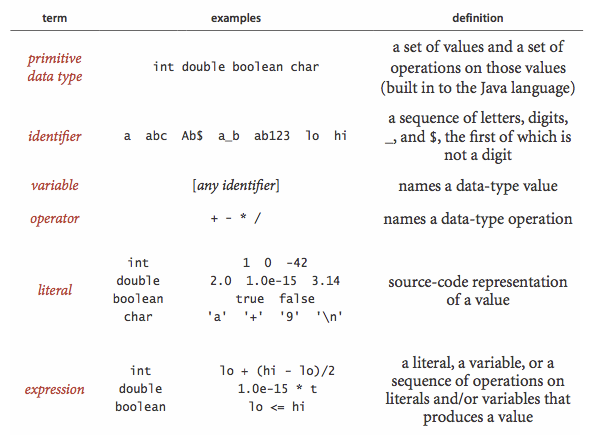
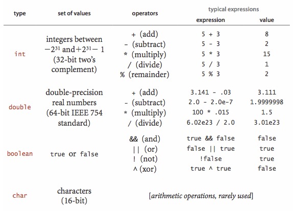
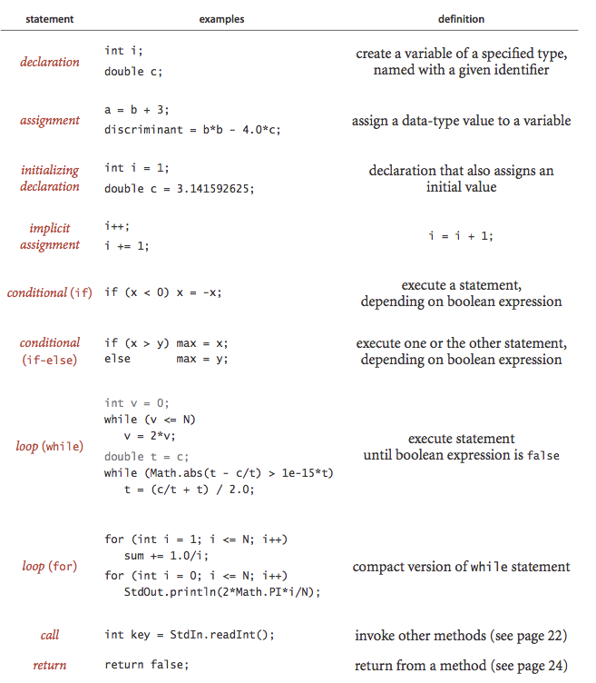
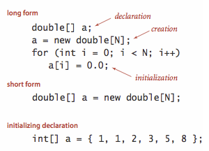
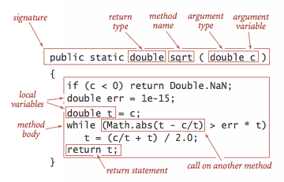
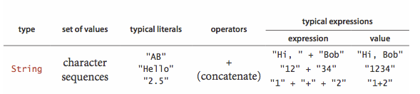
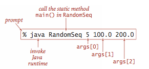
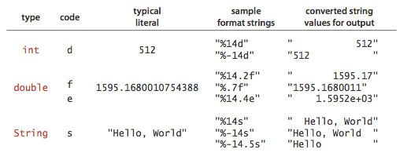
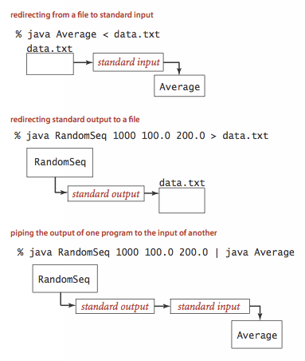
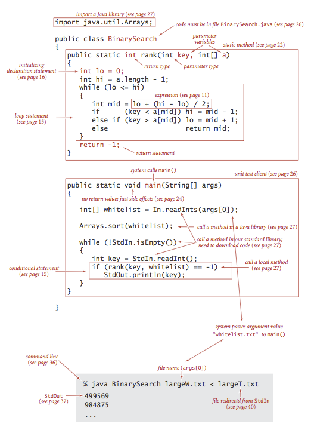

# Algorithms
Algorithms and data structures

## Algorithms,4TH EDITION

### Chapter1:Fundaments
- introduces a scientific and engineering basis for comparing algorithms and making predictions.It also includes our programming model.

#### Programming Model
##### Primitive data types and expressions
A data type is a set of values and a set of operations on those values

Primitive data types and set of values
- Integers(int)
- Real numbers(double)
- Booleans(boolean)
- Characters(char)

- Expressions:operators and precedence order
- Type conversion:type convert
- Comparisons: ==,!=,<,<=,>,>=
- other primitive types

##### Statements
A Java program is composed of Statements
- Declarations:create variables of a specified type
- Assignments:associate a data-type value with a variable
- Initializing:initialize a variable
- Implicit assignments:i++,i/=2
- Conditionals:IF
- Loops:WHILE and FOR
- Break and continue
- For notation
- Single-Statement blocks3

##### Arrays
An Array stores a sequence of values that are all of the same type
- Creating and initializing an array
- Default array initialization
- Initializing declaration

- Using an array:a[]
- Aliasing
- Two-dimensional arrays

##### Static methods
Static methods are called functions in other language
- Defining a static method

- Invoking a static method
- Properties of methods:Arguments are passed by value;Method names can be overloaded;A method has a single return value but may have multiple return statements;A method can have side effects
- Recursion:a method that calls itself either directly or indirectly
- Basic programming model
- Modular programming:static methods in one library can call static methods defined in other libraries
- Unit testing:main()
- External libraries:

##### APIs
- Java libraries
- Our standard libraries
- Your own libraries

##### Strings

- Concatenation
- conversion
- automatic conversion
- command_line arguments

##### Input and Output
- commands and Arguments

- standard output
- Formatted output

- standard input
- Redirection and piping

- Input and output from a file
- standard drawing

##### Binary search

